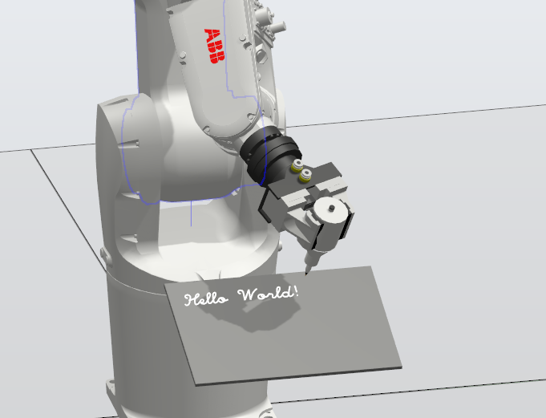

# Hershey-ABBRobot-Handwriting

Simulation and source code demonstrating a robot writing in cursive using Hershey vector fonts. This project converts Hershey vector font data into ABB RAPID robot programming language code, enabling industrial robots to perform handwriting tasks.

## Overview

This project demonstrates how to use ABB industrial robots for handwriting applications by converting vector font data from the Hershey font collection into robot movement commands. The system generates cursive handwriting by translating character stroke data into precise robot trajectories.




## Features

- **Vector Font Processing**: Converts Hershey cursive font data into robot-executable code
- **RAPID Code Generation**: Automatically generates ABB RAPID procedures for each character
- **Pen Control**: Includes pen up/down commands for proper writing behavior  
- **Character Spacing**: Automatically calculates and applies proper character spacing
- **Complete Character Set**: Supports uppercase, lowercase, numbers, and special characters
- **RobotStudio Simulation**: Includes a complete simulation setup for testing

## Project Structure

```
├── HandWriting.rspag          # ABB RobotStudio simulation project
├── hersheyCursiveModule.mod   # Generated RAPID module with character procedures
├── hersheyToRapid.py         # Python script to generate RAPID code
├── img/                       # Demo images and videos
│   └── Capture.PNG           # Sample handwriting output
├── requirements.txt          # Python dependencies
├── LICENSE                   # MIT License
└── README.md                 # This file
```

## Requirements

### Software
- **ABB RobotStudio** (for simulation and deployment)
- **Python 3.x** (for code generation)

### Hardware (for real robot deployment)
- ABB Industrial Robot (6-axis recommended)
- Writing tool/pen attachment
- Writing surface setup
- Digital I/O for pen control

## Installation

1. **Clone the repository**:
   ```bash
   git clone https://github.com/FLo-ABB/Hershey-ABBRobot-Handwriting.git
   cd Hershey-ABBRobot-Handwriting
   ```

2. **Install Python dependencies**:
   ```bash
   pip install -r requirements.txt
   ```

3. **Open the simulation** (optional):
   - Launch ABB RobotStudio
   - Open `HandWriting.rspag` project file

## Usage

### Generating RAPID Code

To regenerate the RAPID module with custom modifications:

```bash
python hersheyToRapid.py
```

This will create/update `hersheyCursiveModule.mod` with procedures for all supported characters.

### Character Procedures

Each character has its own RAPID procedure following this naming convention:
- Lowercase: `char_a()`, `char_b()`, etc.
- Uppercase: `char_upperA()`, `char_upperB()`, etc.
- Numbers: `char_0()`, `char_1()`, etc.
- Special chars: `char_exclamation()`, `char_period()`, etc.

### Robot Setup Requirements

The generated RAPID code expects the following to be defined in your robot system:

```rapid
! Required variables and tools
VAR robtarget refTarget;     ! Reference position for writing
VAR speeddata vSpeed;        ! Movement speed
VAR tooldata tTool;          ! Writing tool definition
VAR wobjdata wWobj;          ! Work object (writing surface)
VAR signaldo do_pen;         ! Digital output for pen control
```

## License

This project is licensed under the MIT License - see the [LICENSE](LICENSE) file for details.

## Acknowledgments

- **Hershey Fonts**: This project uses the Hershey vector font collection
- **ABB Robotics**: For the RAPID programming language and RobotStudio platform
- **Python Hershey-Fonts Library**: For providing easy access to Hershey font data

## Author

**F. LOBERT** - [FLo-ABB](https://github.com/FLo-ABB)

---

*For questions, issues, or contributions, please use the GitHub issue tracker or submit a pull request.*
